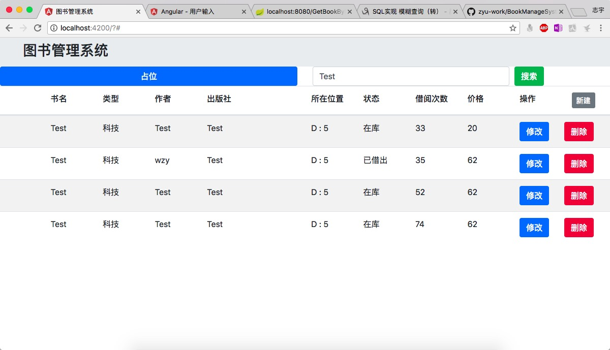

# BookManageSystem
一个类似图书馆管理的项目

1. 项目组成

   1. 前端:Angular+BootStrap(正在学习，用的还不怎么熟练)
   2. 后台:Spring Boot V2.0.1 Java1.8
   3. 数据库:Mysql

   ps:这个仓库主要负责存储一些代码，不做过多的说明

2. 命名

   1. Angular项目：BMS
   2. SpringBoot项目：bms-demo
   3. Mysql数据库：bms

#### 2018.5.2

​	初步完成简单的管理界面

​	但是由于对Angular不熟练，对服务器的请求还是用JavaScript发的:disappointed:	之后会改的